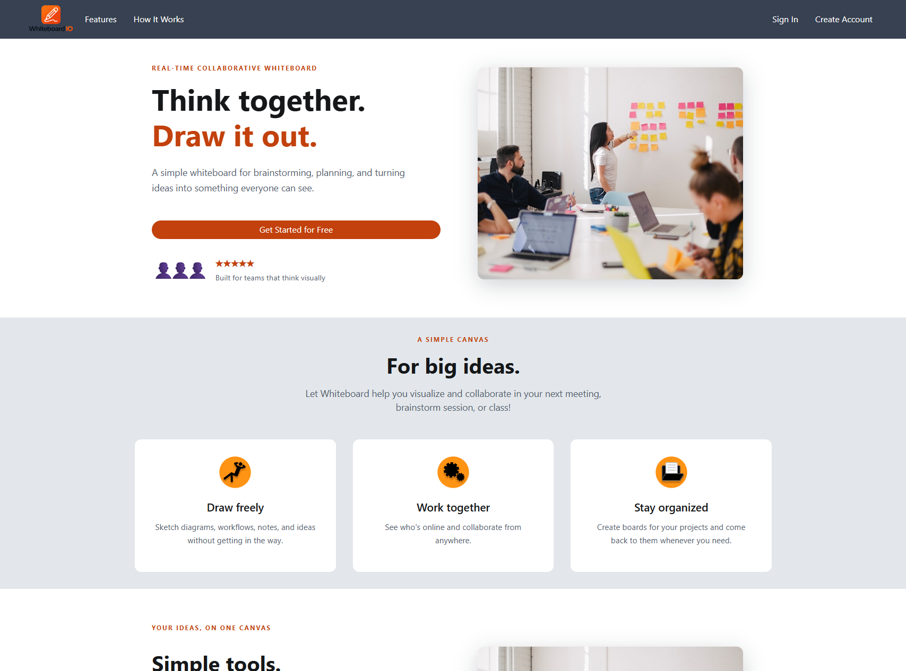
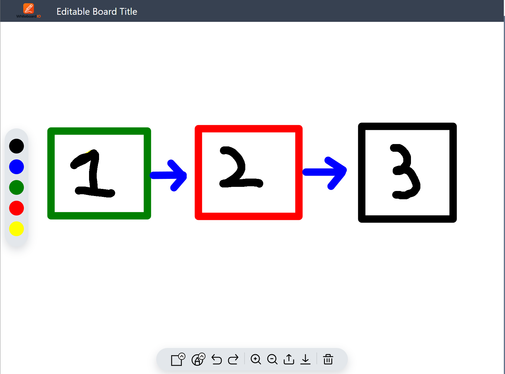
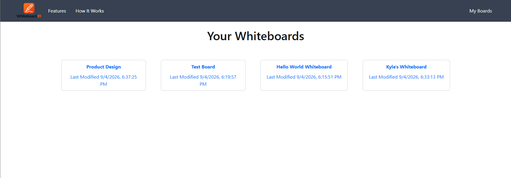

# Whiteboard.IO

> **A full-stack real-time collaborative whiteboard application built with React, Node.js, Express, Socket.IO, and MongoDB.**

Whiteboard.IO allows users to create accounts, create and manage digital whiteboards, draw on shared canvases, and collaborate with other users in real time.

The project was built as an end-to-end full-stack application, covering **frontend development, backend APIs, authentication, session management, database persistence, real-time communication, and application security.**

## Technologies Used

**Frontend:** React, Redux, React Router, Material UI, Bootstrap, Socket.IO Client, Axios, Formik, Yup

**Backend:** Node.js, Express, Socket.IO, MongoDB, Passport, Express Session, Connect-Mongo, bcrypt

**Testing & Development:** Jest, Create React App, npm, Git

---

## Application Screenshots

### Landing Page 


### Whiteboard

<!-- Add screenshot here -->



### Whiteboard Management

<!-- Add screenshot here -->



---

## Project Overview

Whiteboard.IO was designed to explore the architecture behind a **multi-user, stateful web application** rather than simply building a static frontend.

### What users can do

* **Create an account** and authenticate
* **Create and access whiteboards**
* **Draw on a shared canvas**
* **See other active users** on the same board
* **Collaborate in real time** through persistent connections
* **Rename whiteboards**
* **Share whiteboards** using a URL
* **Persist whiteboard data** using MongoDB

---

## Why I Built It

I built Whiteboard.IO to work through several areas of full-stack application development that are important in production software:

* Real-time client/server communication
* Persistent application state
* User authentication and authorization
* Session management
* Database integration
* REST API design
* WebSocket communication
* Frontend state management
* Application security
* Modular backend architecture

Rather than treating the application as a static frontend project, the goal was to build the supporting infrastructure required for multiple users to interact with the same application state.

---

## Architecture

Whiteboard.IO is divided into three primary areas:

```text
whiteboard.io/
├── client/       # React frontend
├── server/       # Node.js / Express backend
└── build-tool/   # Build-related tooling
```

### High-Level Architecture

```text
┌──────────────────────────┐
│       React Client       │
│                          │
│   UI / Canvas / Redux    │
└────────────┬─────────────┘
             │
             │ HTTP / REST
             │
             │ WebSockets
             ▼
┌──────────────────────────┐
│    Node.js / Express     │
│                          │
│  REST API / Auth /       │
│  Sessions / Business     │
│  Logic / Socket.IO       │
└────────────┬─────────────┘
             │
             │
             ▼
┌──────────────────────────┐
│         MongoDB          │
│                          │
│ Users / Boards /         │
│ Sessions / Application   │
│ Data                     │
└──────────────────────────┘
```

The application uses:

* **REST APIs** for standard client/server operations
* **Socket.IO** for real-time communication
* **MongoDB** for persistent application data
* **Express Sessions + Passport** for authentication and session handling
* **Redux** for client-side state management

---

## Core Features

### Real-Time Collaboration

Socket.IO provides the communication layer between connected users.

This allows the application to maintain persistent connections and exchange information between clients without requiring users to manually refresh the page.

### Whiteboard Management

Authenticated users can:

* Create new whiteboards
* Open existing whiteboards
* Rename whiteboards
* Share boards through URLs
* View other users currently active on a board

### Authentication & Sessions

The application uses **Passport** and **Express Session** to provide account-based authentication.

Authentication functionality includes:

* Local email/password authentication
* Guest access
* Password verification
* Session-based authentication
* MongoDB-backed session persistence

Passwords are hashed using **bcrypt** rather than being stored as plaintext.

### Persistent Data

MongoDB serves as the application's persistence layer.

The backend retrieves its database connection through environment configuration rather than embedding credentials directly in the source code.

### Backend Middleware

The Express application uses middleware to address common application and security concerns:

* **Helmet** for HTTP security headers
* **CORS** for cross-origin request configuration
* **Compression** for HTTP response compression
* **Cookie Parser** for cookie handling
* **Express Session** for session management
* **JSON parsing** for API requests

---

## Security & Configuration

Sensitive configuration is kept outside of source control.

The application uses environment variables for configuration such as:

```text
DB_URI
SESSION_SECRET
REACT_APP_BASE_URL
PORT
NODE_ENV
```

Create a local:

```text
server/.env
```

Example:

```env
DB_URI=<your-mongodb-connection-string>
SESSION_SECRET=<your-random-session-secret>
REACT_APP_BASE_URL=http://localhost:3000
NODE_ENV=development
PORT=8080
```

> **Security**
>
> Never commit real database credentials, session secrets, private keys, API secrets, or other sensitive credentials to the repository.

The repository's `.gitignore` excludes environment files from version control.

---

## Running Locally

### Prerequisites

You'll need:

* **Node.js 16.x**
* **npm**
* **MongoDB**
* **Git**

The backend currently specifies **Node.js `16.13.1`** in its package configuration.

### 1. Clone the Repository

```bash
git clone https://github.com/Kyle-Kerlew/whiteboard.io.git
cd whiteboard.io
```

### 2. Configure the Backend

Create:

```text
server/.env
```

Add your local configuration:

```env
DB_URI=<your-mongodb-connection-string>
SESSION_SECRET=<your-session-secret>
REACT_APP_BASE_URL=http://localhost:3000
NODE_ENV=development
PORT=8080
```

### 3. Install Backend Dependencies

```bash
cd server
npm install
```

### 4. Start the Backend

```bash
npm start
```

The backend listens on port `8080` by default.

### 5. Install Frontend Dependencies

Open another terminal:

```bash
cd client
npm install
```

### 6. Start the Frontend

```bash
npm run dev
```

The frontend will start using the project's Create React App development tooling.

---

## Project Structure

```text
client/
├── public/
└── src/
    ├── components/
    ├── containers/
    ├── redux/
    ├── services/
    └── ...

server/
├── configuration/
│   └── passportConfig.js
├── persistence/
│   └── connections/
│       └── mongodb.js
├── rest/
│   └── controller/
├── service/
├── socket/
│   └── socketHandler
├── app.js
└── package.json
```

The backend separates major application responsibilities into:

* **REST controllers**
* **Services**
* **Persistence**
* **Authentication configuration**
* **Socket.IO communication**

This structure keeps application responsibilities separated rather than placing the majority of the application logic inside a single server file.

---

## Technical Highlights

### Full-Stack Development

Designed and implemented both the **React frontend** and **Node.js backend**, including the communication between the two layers.

### Real-Time Systems

Implemented **Socket.IO** communication to support persistent connections and real-time interaction between connected users.

### Authentication

Implemented **Passport-based authentication** with local and guest authentication strategies.

### Session Management

Used **Express Session** with MongoDB-backed session storage to maintain authenticated user sessions.

### Database Integration

Implemented MongoDB persistence for application data and session storage.

### State Management

Used **Redux** to manage client-side application state across the React application.

### API Development

Structured backend functionality around **REST controllers and service-layer architecture**.

### Security

Implemented security-conscious configuration using:

* Environment variables for secrets
* bcrypt password hashing
* Helmet security headers
* Session configuration
* CORS configuration
* Cookie handling

---

## What This Project Demonstrates

Whiteboard.IO was built to demonstrate the engineering involved in taking a web application beyond the UI layer.

The project combines:

**Frontend → Backend → Authentication → Sessions → Database → Real-Time Communication**

This required designing the communication between multiple application layers while maintaining consistent state for users interacting with the same resources.

---

## Project Status

Whiteboard.IO is a **portfolio project demonstrating full-stack application development and real-time collaboration.**

The project is not intended to compete with feature-heavy commercial whiteboard platforms. Its purpose is to demonstrate the engineering involved in building a multi-user application across the frontend, backend, database, authentication, session management, and real-time communication layers.

---

## Author

**Kyle Kerlew**

Software Engineer specializing in:

* Full-stack web application development
* Backend systems
* Java & Node.js
* React and modern JavaScript
* REST APIs
* Real-time applications
* Cloud and distributed systems

**GitHub:**
https://github.com/Kyle-Kerlew

**LinkedIn:**
https://www.linkedin.com/in/kylekerlew/

**Portfolio:**
https://kylekerlew.com
